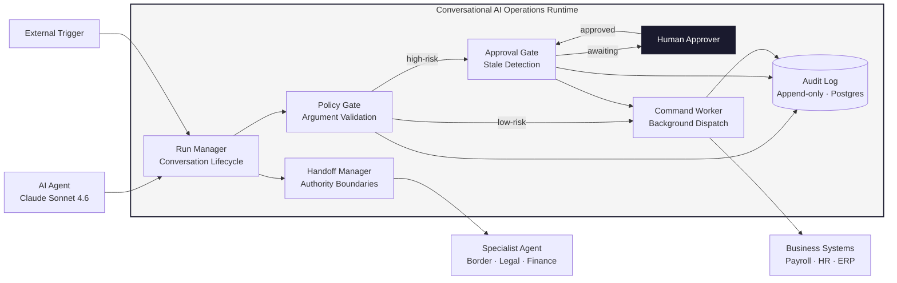
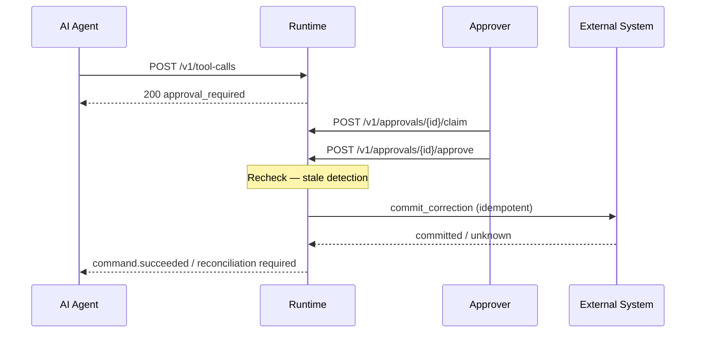

# Conversational AI Operations Runtime

**A production-grade open-source API (Apache 2.0) for teams building AI agents in regulated industries. Sits between the AI model and business systems (payroll, HR, ERP) and governs every action the agent takes before any side effect occurs.**

**Two design choices distinguish it from comparable runtimes: `command.status = unknown` is a durable, recoverable state the runtime blocks on and reconciles, not an exception to surface to the caller; and stale approval detection rechecks the provider resource version immediately before dispatch, invalidating any approval made against an outdated record.**

[](https://opensource.org/licenses/Apache-2.0)
[](https://www.python.org/)
[](#status)

---



---

## The problem

AI agents that modify business systems (payroll, booking, HR, ERP) need a layer between the model and the provider that handles: argument validation, policy evaluation, human approval, idempotent commit, unknown outcomes, and audit. Most teams build this for every integration point, duplicated and inconsistent.

This runtime is that layer, built once, as a protocol, separate from the model.

## Key capabilities

- **First-class unknown state** — `command.status = unknown` is a durable, recoverable state, not an exception; the runtime blocks retry until reconciliation confirms or denies the outcome
- **Stale approval detection** — recheck provider resource state right before dispatch; if the record changed since the agent prepared the proposal, the approval is invalidated and the human must re-review
- **Typed provider adapter contract** — `prepare`, `commit`, `verify`, and `reconcile` are explicitly callable methods with typed request and result objects; the contract is defined once and enforced by the conformance suite
- **Multi-agent handoffs** — transfer context across authority boundaries without leaking full conversation history; the receiving agent gets a scoped context package, not the source session
- **Policy-gated execution** — intercept model tool calls and route high-risk operations to human approval before any side effect occurs

---

## How it compares

| | This runtime | AxonFlow | JamJet | Tandem |
|---|:-:|:-:|:-:|:-:|
| License | Apache 2.0 | BSL 1.1 | Apache 2.0 | Proprietary |
| Unknown outcome as first-class state | ✓ | ? | ? | ? |
| Stale approval detection | ✓ | ? | ? | ? |
| Typed provider adapter contract | ✓ | ? | ? | ? |
| REST-first (no SDK required) | ✓ | ? | ? | ? |

`?` = not confirmed from documentation review. Hands-on testing pending.

[Full feature matrix](docs/competitive-matrix.md) · [Per-product notes](docs/competitor-notes/)

---

## Two layers

```text
Your agent (Claude, OpenAI, LangGraph, anything)
      |
      | POST /v1/tool-calls
      |
┌─────▼──────────────────────────────────────────┐
│  Action boundary (core protocol)               │
│  argument validation                           │
│  policy gate                                   │
│  proposal creation                             │
│  human approval                                │
│  authorization recheck (stale detection)       │ → provider adapter → commit
│  idempotent dispatch                           │ ← provider_reference
│  unknown-outcome detection                     │
│  reconciliation                                │
│  append-only audit                             │
└────────────────────────────────────────────────┘
      |
      | optional
      |
┌─────▼──────────────────────────────────────────┐
│  Managed runs (reference runtime)              │
│  POST /v1/runs, /v1/runs/{id}/messages         │
│  Owns conversation lifecycle and model calls   │
└────────────────────────────────────────────────┘
```

**Submit a tool call directly** and the runtime handles the rest. You do not need the managed-run layer. Bring your own conversation manager and pass `context.run_id` or `context.conversation_id` as external references.

**Or use managed runs** if you want the runtime to own the full conversation lifecycle and model orchestration.

---

## Quick Start

**Prerequisites:** Docker, Python 3.13+

```bash
git clone https://github.com/nenedesign/conversational-ops-runtime.git
cd conversational-ops-runtime

# Install dependencies (hash-verified)
pip install -r requirements.txt

# Start Postgres and apply schema (idempotent — safe to re-run)
make db-up

# Start the API on :8080
make dev
```

Copy `.env.example` to `.env` and set `ANTHROPIC_API_KEY` to use managed runs. The default `API_KEY=dev-api-key-001` works for local testing against all core endpoints.

See [`client_example.py`](client_example.py) for a full 8-step end-to-end walkthrough using raw HTTP.

---

## Core protocol: POST /v1/tool-calls

The model output is a tool request. The runtime response is not necessarily a tool result:

```http
POST /v1/tool-calls
Idempotency-Key: tc-run_123-EMP4412-001   ← include on every mutation

{
  "agent": { "id": "payroll-agent-a", "version": "0.3.1" },
  "action": {
    "tool_name": "prepare_classification_correction",
    "arguments": {
      "employee_id": "EMP-4412",
      "correction_type": "misclassification_contractor_to_employee",
      "evidence_ids": ["evidence_123"]
    }
  },
  "context": { "actor_id": "user_789" }
}

→ 200 OK
{
  "tool_call_id": "tc_456",
  "status": "approval_required",      ← one of: proposal_created | approval_required | rejected | command_created | unknown
  "approval": {
    "approval_id": "approval_234",
    "risk_level": "high",
    "expires_at": "2026-09-17T14:23:00Z"
  },
  "next_action": "await_approval"
}
```



---

## Six resources

| Resource | Meaning |
|----------|---------|
| `ToolCall` | Model-proposed action. Unvalidated at submission. |
| `Proposal` | Structured, reviewable description of the intended action. |
| `ProposalVersion` | Immutable snapshot of one version. Append-only. |
| `Approval` | Human decision record tied to a specific proposal version. |
| `Command` | Authorized side effect. Created only after `authorization.passed`. |
| `CommandAttempt` | One provider dispatch attempt. |

A command does not exist until a human approves and the runtime confirms the resource has not changed since prepare. The model cannot authorize its own actions.

---

## Golden event sequence

```text
tool_call.received
proposal.created
policy.evaluated
approval.required          ← run pauses
approval.claimed
approval.approved
authorization.rechecked    ← stale detection happens here
authorization.passed
command.created            ← command only exists after this point
command.dispatched
command.succeeded
run.completed
```

Failure branches (stale approval, unknown outcome, expired, revised) are in [`spec/golden_sequence.json`](spec/golden_sequence.json).

---

## Design goals

Several products address governed agent execution. From documentation review, the closest are [AxonFlow](https://github.com/getaxonflow/axonflow) (BSL 1.1, broad enterprise platform), [JamJet](https://jamjet.dev) (Apache 2.0, "action-control plane for AI agents"), and [Tandem](https://tandem.ac) (authority and runtime model, enterprise focus). LangGraph and Temporal are complementary — better understood as integration targets than competitors. See [`docs/competitive-matrix.md`](docs/competitive-matrix.md) and [`docs/competitor-notes/`](docs/competitor-notes/) for per-product research notes.

This runtime is designed around a specific set of goals. We have not yet done hands-on testing to confirm which of these are genuinely absent from the closest products — that is the next stage of work (see [Status](#status)):

- **Typed provider adapter contract** — `prepare`, `commit`, `verify`, `reconcile` as explicit, separately callable methods with typed request and result objects. The contract is defined in [`adapters/adapter_interface.py`](adapters/adapter_interface.py) with a conformance test suite.
- **Unknown outcome as a first-class state** — `command.status = unknown` is a durable state, not an exception. The runtime blocks retry until reconciliation completes. Returning `"unknown"` from `commit_correction` is the documented contract, not a workaround.
- **Stale approval detection** — `authorization.rechecked` compares the provider resource version recorded at prepare time against the current version before dispatch. A stale approval is invalidated; the human must re-review against the current state.
- **Immutable proposal versioning** — each revision creates a new `ProposalVersion` record. The command pins the exact approved version. The approval history is preserved in full.
- **REST-first protocol** — the action boundary is a public HTTP API. No SDK required to submit a tool call or integrate an approval workflow.
- **Apache 2.0** — permissive open source. AxonFlow uses BSL 1.1 (source-available, not permissive). Confirmed from public repository licensing.

---

## Action boundary endpoints (core protocol)

| Method | Path | Description |
|--------|------|-------------|
| POST | `/v1/tool-calls` | Primary entry point — submit a model tool request |
| GET | `/v1/tool-calls/{tool_call_id}` | Get a submitted tool call |
| GET | `/v1/proposals/{proposal_id}` | Get a proposal |
| GET | `/v1/proposals/{proposal_id}/versions` | List all versions of a proposal |
| GET | `/v1/proposals/{proposal_id}/versions/{version}` | Get a specific proposal version |
| GET | `/v1/approvals` | List approvals |
| GET | `/v1/approvals/{approval_id}` | Get an approval with proposal and evidence |
| POST | `/v1/approvals/{approval_id}/claim` | Claim an approval for review |
| POST | `/v1/approvals/{approval_id}/release` | Release a claim without deciding |
| POST | `/v1/approvals/{approval_id}/approve` | Approve a proposal version — triggers dispatch |
| POST | `/v1/approvals/{approval_id}/reject` | Reject a proposal version |
| POST | `/v1/approvals/{approval_id}/revise` | Revise a proposal — creates a new immutable version |
| GET | `/v1/commands` | List commands |
| GET | `/v1/commands/{command_id}` | Get command state and lifecycle |
| GET | `/v1/commands/{command_id}/attempts` | Get dispatch attempts for a command |
| POST | `/v1/commands/{command_id}/reconcile` | Trigger provider reconciliation for unknown state |

## Managed run endpoints (optional reference runtime)

| Method | Path | Description |
|--------|------|-------------|
| POST | `/v1/runs` | Create a run |
| GET | `/v1/runs/{run_id}` | Get run state |
| POST | `/v1/runs/{run_id}/messages` | Send a message or resume after approval (empty body = resume) |
| GET | `/v1/runs/{run_id}/events` | Append-only audit event log |
| POST | `/v1/runs/{run_id}/cancel` | Cancel a run |
| POST | `/v1/runs/{run_id}/replay` | Replay a run *(planned)* |
| POST | `/v1/runs/{run_id}/handoffs` | Trigger an agent handoff externally |
| GET | `/v1/runs/{run_id}/handoffs` | List handoffs for a run *(planned)* |
| GET | `/v1/handoffs/{handoff_id}` | Get handoff state |

---

## Provider adapter contract

```python
class PayrollProvider(Protocol):
    def capabilities(self) -> ProviderCapabilities: ...

    async def prepare_correction(
        self, request: PrepareCorrectionRequest
    ) -> CorrectionProposal:
        # No side effects. Safe to call multiple times.
        # Called at stale approval recalculation too.
        ...

    async def commit_correction(
        self, request: CommitCorrectionRequest, idempotency_key: str
    ) -> CommitResult:
        # status: "committed" | "rejected" | "duplicate" | "unknown"
        # Return "unknown" on timeout. Do not raise.
        ...

    async def reconcile_correction(
        self, request: ReconcileRequest
    ) -> ReconciliationResult:
        # Called only when command.status is "unknown".
        # Query by idempotency_key. Determine whether the operation committed.
        ...
```

See [`adapters/adapter_interface.py`](adapters/adapter_interface.py) for the full Protocol with `verify`, capability tiers, and the `SimulatedPayrollProvider` with failure injection.

---

## Phase 0 artifacts (this repo)

| Artifact | Purpose |
|----------|---------|
| [`spec/openapi.yaml`](spec/openapi.yaml) | Full API specification (OpenAPI 3.1) |
| [`spec/schemas/`](spec/schemas/) | JSON Schema Draft 2020-12 for all resources |
| [`spec/events/catalog.yaml`](spec/events/catalog.yaml) | 20 webhook events with delivery semantics |
| [`spec/golden_sequence.json`](spec/golden_sequence.json) | Primary event sequence + failure branches |
| [`spec/state_machines.md`](spec/state_machines.md) | State transition diagrams |
| [`spec/error_model.md`](spec/error_model.md) | Error codes and client guidance |
| [`spec/idempotency.md`](spec/idempotency.md) | Key format, window tiers, provider enforcement |
| [`spec/auth_model.md`](spec/auth_model.md) | Tenant isolation, scope definitions |
| [`spec/versioning.md`](spec/versioning.md) | Compatibility guarantees, deprecation policy |
| [`spec/threat_model.md`](spec/threat_model.md) | Injection vectors, authorization boundaries |
| [`spec/tool_contracts/payroll.json`](spec/tool_contracts/payroll.json) | Tool argument schemas for payroll domain |
| [`spec/tool_contracts/handoff.json`](spec/tool_contracts/handoff.json) | `trigger_agent_handoff` tool contract with authority boundary |
| [`migrations/001_initial.sql`](migrations/001_initial.sql) | Postgres schema with ownership annotations |
| [`adapters/adapter_interface.py`](adapters/adapter_interface.py) | Python Protocol + simulated provider |
| [`conformance/test_core_endpoints.py`](conformance/test_core_endpoints.py) | pytest conformance suite |
| [`client_example.py`](client_example.py) | End-to-end client walkthrough (raw HTTP) |
| [`spec/examples/curl_example.sh`](spec/examples/curl_example.sh) | curl walkthrough |

---

## Status

**Phase 0: complete.** Spec, schemas, event catalog, database schema, adapter interface, conformance tests.

**Phase 1: complete — tested 2026-09-16.**

The following were verified end-to-end against a live Postgres instance using `SimulatedPayrollProvider`:

- `POST /v1/tool-calls` — argument validation (extra field rejected, invalid enum rejected), policy gate (high-risk tool routed to approval), proposal and approval records created in a single transaction, 4 audit events written (`tool_call.received`, `proposal.created`, `policy.evaluated`, `approval.required`)
- Idempotency — repeat submission with the same `Idempotency-Key` and identical body returned the cached response; no new records or audit events were created
- `POST /v1/approvals/{id}/approve` — authorization recheck passed (resource version matched), 3 audit events written (`authorization.rechecked`, `authorization.passed`, `command.created`), command created with unique dispatch idempotency key
- `GET /v1/commands/{id}` — command record at `status: authorized` with full chain of custody: `tool_call_id`, `proposal_id`, and `approval_id` all linked

Source: [`src/`](src/). Runs with `make db-up && make dev`. Requires Docker and Python 3.13+.

**Competitive testing: pending.** Hands-on testing of AxonFlow, JamJet, and Tandem against the design goals listed above has not yet been completed. The Design goals section reflects intent. Findings will be documented in `docs/competitor-notes/` when testing is done.

**Phase 2: complete — tested 2026-09-16.**

The following were verified end-to-end against a live Postgres instance using `SimulatedPayrollProvider`:

- Command worker (`src/worker.py`) — background asyncio task polls the outbox every 2 seconds using `FOR UPDATE SKIP LOCKED`, claims events with a 30-second lease, calls `commit_correction`, and records the outcome atomically
- `committed` outcome — `command.status` updated to `succeeded`, `downstream_reference` set to the provider transaction ID (`payroll-tx-{key}`)
- `GET /v1/commands/{id}/attempts` — attempt record created with `worker_id`, `provider_reference`, and `completed_at` timestamps
- Full audit chain across both services verified: 9 events per governed loop — `tool_call.received`, `proposal.created`, `policy.evaluated`, `approval.required`, `authorization.rechecked`, `authorization.passed`, `command.created` (action-service), `command.dispatched`, `command.succeeded` (command-worker)
- `POST /v1/commands/{id}/reconcile` — reconciliation endpoint live; returns `409 not_reconcilable` for commands not in `unknown` state; calls `reconcile_correction`, writes `command.reconciled` audit event, updates `reconciliation_tasks`
- `unknown` outcome — code-complete: worker sets `command.status = 'unknown'`, creates `reconciliation_tasks` record, writes `command.unknown` audit event; `SimulatedPayrollProvider` triggers this path when instantiated with `inject_timeout=True`
- Shared provider singleton (`src/provider.py`) — all routers and the worker share one `SimulatedPayrollProvider` instance so in-memory idempotency key tracking is consistent across the full request lifecycle

**Phase 3: complete — tested 2026-09-16.**

The following were verified end-to-end against a live Postgres instance using `SimulatedPayrollProvider` and Claude Sonnet 4.6:

- `POST /v1/runs` — run created with `status: created`; system prompt selected by `agent_id` (`payroll-detective`)
- `POST /v1/runs/{id}/messages` — agent called `investigate_payroll_anomaly` (read-only, no approval), then `prepare_classification_correction` (approval required); run paused at `status: awaiting_approval` with `pending_approval` block in the response
- Approval, command creation, and worker dispatch followed the same path as Phase 2 — 9 audit events through `command.succeeded` with `downstream_reference: payroll-tx-{key}`
- `POST /v1/runs/{id}/messages` (empty body = resume signal) — runtime detected command succeeded, fed provider reference to Claude, returned `status: completed` with a final structured summary
- `GET /v1/runs/{id}/events` — 11-event audit chain: `tool_call.received` → `proposal.created` → `policy.evaluated` → `approval.required` → `authorization.rechecked` → `authorization.passed` → `command.created` → `command.dispatched` → `command.succeeded` → `run.completed`

New endpoints: `POST /v1/runs`, `GET /v1/runs/{id}`, `POST /v1/runs/{id}/messages`, `GET /v1/runs/{id}/events`, `POST /v1/runs/{id}/cancel`

Requires `ANTHROPIC_API_KEY` in `.env`. Rotate after each test session.

**Phase 4: complete — tested 2026-09-16.**

Multi-agent handoff with authority boundaries. The following were verified end-to-end:

- `trigger_agent_handoff` tool contract (`spec/tool_contracts/handoff.json`) — `is_handoff: true` flag routes the tool through a distinct execution path in `_run_turn` instead of the read-only or approval paths
- Authority boundary enforcement — `payroll-agent-a` carries a `withholding_note` in its read-tool response for AR jurisdiction cases; this triggers `trigger_agent_handoff` with `to_agent: border-agent-a`
- `_execute_handoff_records()` — creates the target run and handoff DB record in a single transaction; context package (structured facts, uncertainty statement) is passed as a scoped seed message, not the full conversation history
- Source run closed cleanly — `send_message` detects `outcome: handed_off` and writes `run.handoff_initiated` + `run.completed` audit events; source run status set to `completed`
- `border-agent-a` target run pre-seeded with structured context; `POST /v1/runs/{target_run_id}/messages` verified to produce a relevant response from the receiving agent
- `POST /v1/runs/{run_id}/handoffs` — external handoff trigger (without a managed run tool call) verified: validates source run status, creates target run, writes audit events, returns 201
- `GET /v1/handoffs/{handoff_id}` — handoff record retrieved with `target_run_id` confirmed present

New endpoints: `POST /v1/runs/{id}/handoffs`, `GET /v1/handoffs/{id}`

---

## Roadmap

The four-phase proof-of-concept is complete. These are the next meaningful additions, in rough priority order:

**YAML domain config loader** — agent registry, tool contracts, and authority boundaries currently live in code (`AGENT_SYSTEM_PROMPTS`, `spec/tool_contracts/*.json`). Extracting them to a `config/` directory that the runtime loads at startup would allow domain configuration changes without code deploys. The spec foundation is in `spec/auth_model.md` and the tool contract schema.

**Docker Compose packaging** — a single `docker compose up` that starts Postgres, runs migrations, and starts the API. Currently requires `make db-up && make dev` separately and manual migration via psql pipe. Packaging this simplifies onboarding and enables CI integration testing without a pre-existing Postgres instance.

**OpenTelemetry traces** — the runtime writes a complete audit event log per run (`GET /v1/runs/{id}/events`), but no distributed traces. Adding OTel spans to `_run_turn`, the command worker dispatch loop, and provider adapter calls would make the governed action lifecycle visible in Grafana, Jaeger, or any OTel backend. This is the production observability story.

**Second domain adapter** — the payroll domain is the reference implementation. A second adapter (HR case management, booking, or a generic webhook-out stub) would validate that the provider adapter contract (`adapters/adapter_interface.py`) is genuinely domain-agnostic and not accidentally payroll-specific. The conformance test suite in `conformance/test_core_endpoints.py` is already abstract.

**Competitive testing** — hands-on evaluation of AxonFlow, JamJet, and Tandem against the design goals in the [Design goals](#design-goals) section. Findings will be documented in `docs/competitor-notes/`. The Design goals section currently reflects intent, not tested differentiation.

---

## License

Apache 2.0. See [LICENSE](LICENSE).

---

**Neville Ko** — AI Product Manager and Builder  
[Portfolio](https://www.fromus.ca) · [LinkedIn](https://www.linkedin.com/in/nevilleko/)
